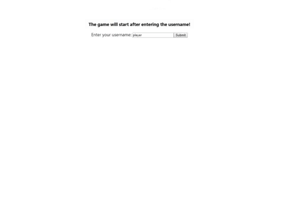
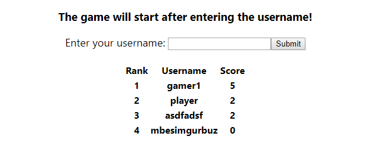

# Flappy Bird Game

Game coded with React

## How to play
`spacebar` to flap the wing. 

### Scoreboard

## Install

1. `npm install` or `yarn add`
2. `cd api`
3.  `json-server --watch db.json --port 3001`
4. `npm start` or `yarn start`
5. Open [http://localhost:3000](http://localhost:3000) to view it in the browser.

Runs the app in the development mode. 
The page will reload if you make edits. 
You will also see any lint errors in the console.

### `npm run build`

Builds the app for production to the `build` folder. 
It correctly bundles React in production mode and optimizes the build for the best performance.

The build is minified and the filenames include the hashes. 
The game is ready to be deployed!